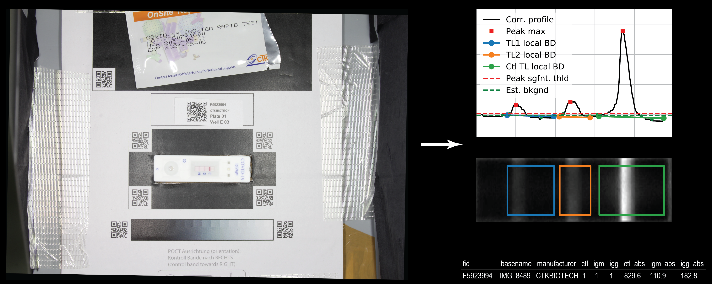
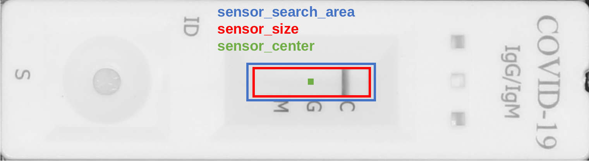
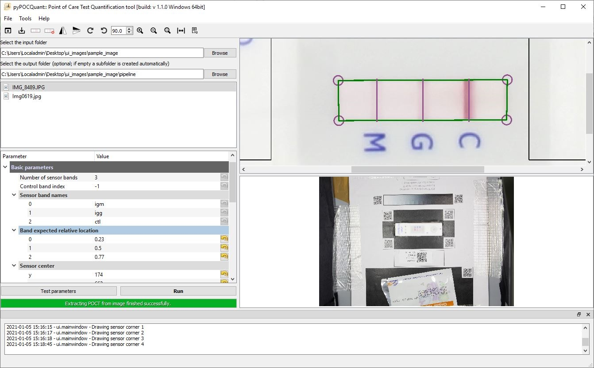
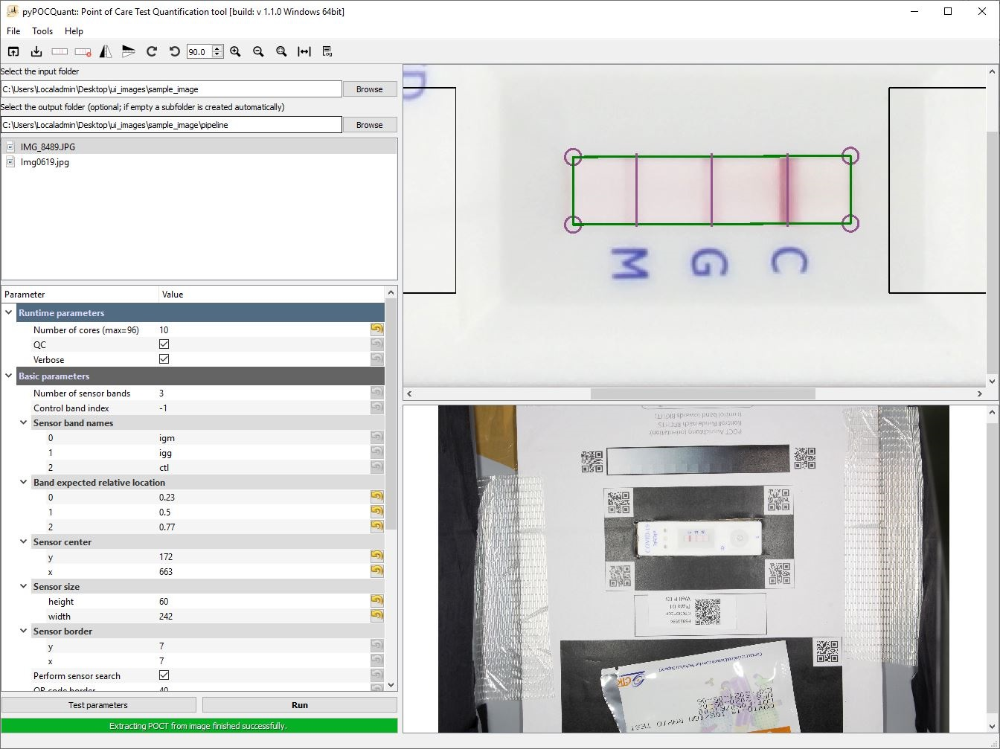
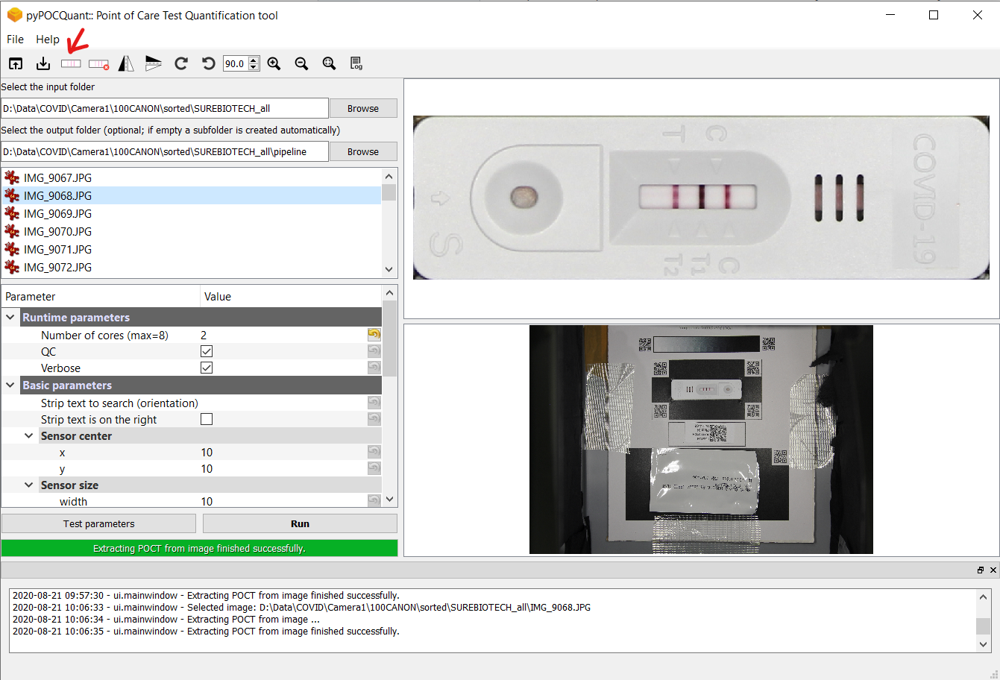

[](https://www.python.org/) [](https://www.python.org/) []() [](https://git.bsse.ethz.ch/cunya/pypocquantui/master/LICENSE)

pyPOCQuant  - A tool to automatically quantify Point-Of-Care Tests from images
======================================


This repository contains the implementation of *pyPOCQuant* to automatically detect and quantify test line (TL) signal bands from lateral flow assays (LFA) images,  as described in the paper: 


* Cuny, A. P., Rudolf, F., & Ponti, A. (2020). pyPOCQuant - A tool to automatically quantify Point-Of-Care Tests from images. MedRxiv,. https://doi.org/10.1101/2020.11.08.20227470


Please [cite the paper(s)](https://github.com/) if you are using this code in your research or work.


## Overview



We developed pyPOCQuant to quantify lateral flow assays (LFA) based Point of Care tests (POCT) from images. The above figure shows an image of a POCT placed on our QR code template as well as a QR code label providing metadata about the sample and test. The POCT gets extracted from the QR code box and fine aligned prior to the detection of the test lines (TLs) from the sensor area. The TLs and their signal strength get quantified after a background subtraction and the results are compiled in a table along with the metadata of the tests automatically for each image.

For a more detailed description please read the user manual or the paper.


## Installation

This package requires Python 3.6 and runs on various platforms. If not explicitly stated differently all the steps below are the same on each platform. Read the installation page in the documentation for more specific information.

1. Please first [install tesseract]( https://tesseract-ocr.github.io/tessdoc/Home.html)

2.1 *pyPOCQuant* can then be installed with `pip`:

```bash
pip install pypocquant
```

2.2. from source:

```bash
git clone git://git.gitlab.com/csb.ethz/pypocquantui.git
```

install dependencies with:

```bash
pip install -r /requirements/base.txt
```
instead of `base.txt` use `mac.txt` or `darwin.txt` depending on your platform.

2.3 from installer / binaries:

​	[download pyPOCQuantUI binaries]( https://github.com/) 

#### Notes

- Depending on your Python installation, you may need to use `pip3` instead of `pip`.

- For both running it from source or with the compiled binaries tesseract needs to be installed an be on PATH.

  


## Usage

We provide an example workflow in a Jupyter [notebook](https://github.com/) that illustrate how this library can be used as well as a step by step __QuickStart__ (add link) guide in the documentation.

### Creating a config file

In the following we present a brief overview how to create a working config file for your images. Detailed instructions and the definition of each parameter can be found in detail in the manual and documentation.  We show how to obtain position and extent of the sensor areas in Fiji or ImageJ. Later we will see how to do the same in the _pyPOCQuant_ user interface (GUI).

Important parameters are the `sensor_size`, `sensor_center`, and `sensor_search_area` (the latter being an advanced parameter).



#### Creating a config file with Fiji

1. Open a settings file (i.e default settings) and adjust the parameters to fit your images.
2. Load an image with Fiji and crop it to the size of the POCT


3. After drawing a rectangular region of interest, the size is displayed in Fiji’s toolbar; e.g. `x=539, y=145, **w=230, h=62**`.

	- When hovering over the central pixels in the top or left sides of the selection, the `x`, and `y` coordinates of the center, respectively, are show in Fiji’s toolbar; e.g. `x=*601*, y=144, value=214` (and equivalently for `y`).
4. With the line tool the distance from the border to the test lines (TLs) can be measured and expressed as relative ration (distance to TL from left border / w) to obtain the `peak_expected_relative_location`.

#### Creating a config file with the GUI

A settings file must not necessarily be created in advance. The Parameter Tree can be edited directly. Optionally, settings can be loaded or saved from the UI. 

1. `Select the input folder` and click on one of the listed images to display it. The POCT region will be automatically extracted and shown in the view at the top. The lower view shows the whole image.

2. Hit the `Draw sensor outline` icon (red arrow) in the toolbar. This will allow you to interactively define the `sensor area` and the `peak_expected_relative_location` parameters.


| Drawing sensor by clicking into the corners                  | Drawing finished with aligned test lines (vertical lines)    |
| ------------------------------------------------------------ | ------------------------------------------------------------ |
|  |  |


3. Draw the four corners of the sensor and place the vertical bars on the test lines (TLs). This will cause all relevant parameters to be populated in the Parameter Tree. Please notice that, by default, the `sensor_search_area` is set to be 10 pixels wider and taller than the `sensor_size`. This can be changed in the advanced parameters (but beware to keep it only slightly larger than the `sensor_size`: it is meant only for small refinements).



4. Save the settings file (Ctrl+S, `File`->`Save settings file`) or test current parameters on one image by clicking the `Test parameters` button under the Parameter Tree.

### Minimal example

Create a Python script or Jupyter notebook cell with the following code to run the pipeline on all images for a given `input_folder_path`.

```python
from pypocquant.lib.pipeline import run_pipeline
from pypocquant.lib.settings import default_settings

# Get the default settings
settings = default_settings()

# Change settings manually as needed
settings["sensor_band_names"] = ('igm', 'igg', 'ctl')

# Alternatively, load existing settings file
# from pypocquant.lib.settings import load_settings
# settings = load_settings('full/path/to/settings/file.conf')

# Set final argument
input_folder_path = 'full/path/to/input/folder'
results_folder_path = 'full/path/to/results/folder'
max_workers = 8 

# Run the pipeline
run_pipeline(
    input_folder_path,
    results_folder_path,
    **settings,
    max_workers=max_workers
)
```


### Command line interface (CLI)

Running *pyPOCQuant* from the CLI is best suited when automating the processing  of  large  amounts  of  images  and  folders.   

To create a default configuration from the CLI, use the ’-c’ flag of pyPOCQuant.py.

```python 
python pyPOCQuant.py −c /PATH/TO/CONFIG/FILE.conf
```

 However, the  easiest  approach  is  to  use  the _pyPOCQuantUI_ (GUI)  for  this  purpose, but it could also be done with other tools, such as Fiji (as described in the manual). 

Once the configuration file is ready, a full study can be started by running  pyPOCQuant  on  a  full  folder  of  images  The  analysis  is performed in parallel, and the number of concurrent tasks can be adjusted by the’-w’(--workers) argument.  

```
python pyPOCQuant.py −f /PATH/TO/INPUT/FOLDER −o /PATH/220TO/RESULTS/FOLDER −s /PATH/TO/CONFIG/FILE −w ${NUMWORKERS}
```

- __`-f`__ `/PATH/TO/INPUT/FOLDER/MANUFACTURER`: path to the folder that contains all images for a given camera and manufacturer.
- __`-o`__ `/PATH/TO/RESULTS/FOLDER`: path where the results (and the quality control images) for a given camera and manufacturer will be saved. The results are saved in a `quantification_data.csv` text file.
- __`-s`__ `/PATH/TO/CONFIG/FILE`: path to the configuration file to be used for this analysis.  Note that a configuration file will be needed per manufacturer and (possibly) camera combination.
- __`-w`__ `NUM_WORKERS`: number of  parallel processes; e.g. `8`.
- __`-v`__: `VERSION` : displays current version of _pyPOCQuant_.
- __`-h`__ `HELP`: displays the CLI arguments and their usage.


### Graphical user interface (GUI)

We also provide a graphical user interface _pyPOCQuantUI_ that enables interactive configuration creation, parameter testing, running the pipeline on a folder, create custom sample identifier QR codes as well as a tool to split images depending on keyword in a QR code tag. 

Detailed installation and usage instructions can be found in the manual and documentation. 


To start the GUI from source navigate into the `pypocquantui` folder and run:

```
fbs run
```

or double click on the pyPOCQuant icon installed by the installer or directly on the downloaded binaries.


After selecting the `INPUT FOLDER` and clicking on an image as i.e IMG_8489.JPG the POCT gets extracted and displayed on the right top. Clicking on the `Draw sensor` button (red arrow) allows to identify the sensor area by clicking into its corners. After aligning the relative position of the test lines (TLs) by dragging the vertical lines the button `Test parameters` will open the `OUTPUT FOLDER` and show the results for the selected image. Clicking the button __`Run`__ will apply the parameters to all images in the selected folder and process each image in parallel.




## Troubleshooting

Installation requires Python 3.6 , PyQT 5 and fbs 0.9 with PyInstaller 3.4. We have tested the package on (macOS, Linux, Windows 7 and 10) Please [open an issue](https://github.com/) if you have problems that are not resolved by the information below.

### Linux

remarks how to install and compile on Linux.

### macOS

remarks how to install and compile on macOS.

### Windows

remarks how to install and compile on Windows.


## How to cite 
```bibtex
@article{cuny2020,
  author    = {Andreas P. Cuny and Fabian Rudolf and Aaron Ponti},
  title     = {A tool to automatically quantify Point-Of-Care Tests from images},
  journal   = {MedRxiv},
  year      = {2020},
  doi       = {10.1101/2020.11.08.20227470}
}
```

