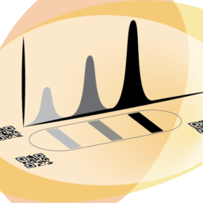

.. pyPOCQuant documentation master file, created by
   sphinx-quickstart on Wed Sep 30 10:16:10 2020.
   You can adapt this file completely to your liking, but it should at least
   contain the root `toctree` directive.

    
Welcome to pyPOCQuant's documentation!
======================================
    
The tool pyPOCQuant aims to automatically detect and quantify signal bands from lateral flow assays (LFA) or Point of Care tests (POC or POCT) from an image. It can batch analyze large amounts of images in parallel.
An analysis pipeline can be run either from the command line (good for automating large numbers of analysis) or from a desktop application.

.. toctree::
   :maxdepth: 2
   :caption: Contents:
   
   installation
   manual
   group
   license
   
Readme
======

.. .. mdinclude:: ../README.md

Indices and tables
==================

* :ref:`genindex`
* :ref:`modindex`
* :ref:`search`

